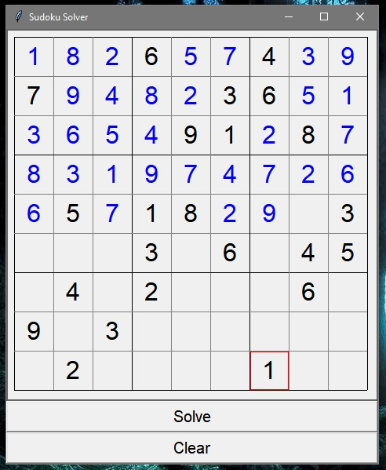

# Sudoku-Solver
Sudoku Solver written in python using the Tkinter module for GUI

- Supports AI solving
- AI visualization included(blue numbers)
  - can be disabled for more difficult sudokus(can take a long time with all the animations)

